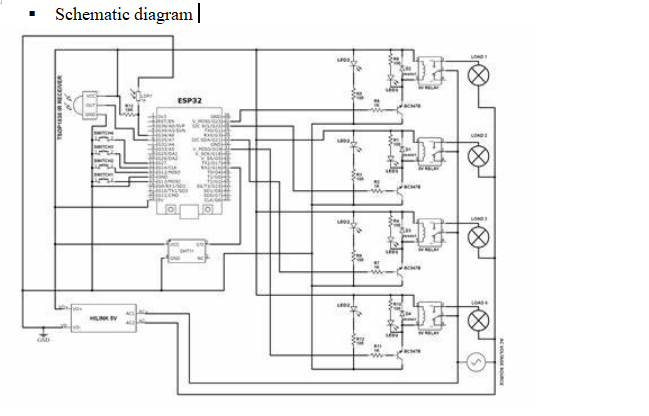
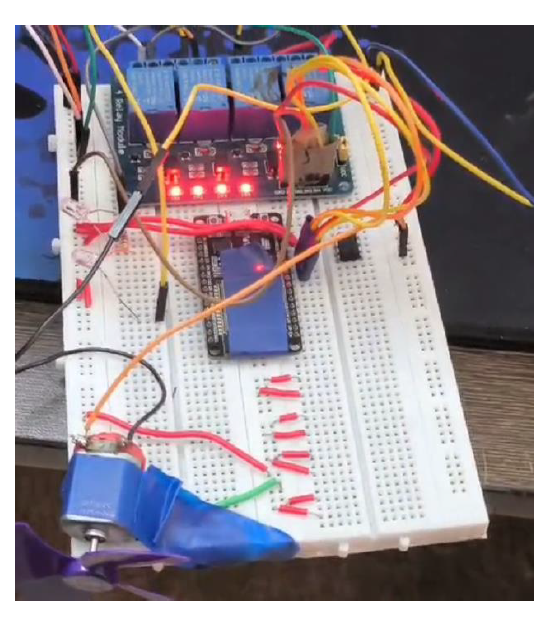

# 🏠 Home Automation using ESP32 and Blynk App

This project demonstrates a simple and scalable IoT-based **Home Automation System** using the **ESP32 Wi-Fi microcontroller** and the **Blynk IoT mobile app**. The goal is to remotely control home appliances like lights, fans, etc., using your smartphone from anywhere in the world.

---

## 🔧 Features

- Remote control of up to 4 appliances via smartphone
- Control using Blynk app interface with buttons
- Real-time relay toggling and feedback
- Secure Wi-Fi based communication
- Compatible with Android and iOS
- Expandable to more devices or sensors

---

## 📱 Tech Stack

| Component      | Description                                |
|----------------|--------------------------------------------|
| **ESP32**      | Wi-Fi enabled microcontroller               |
| **Blynk App**  | IoT mobile platform for control interface   |
| **Arduino IDE**| Used for programming the ESP32              |
| **Relay Module** | 4-channel, 5V relay to control appliances |
| **Wi-Fi**      | For IoT connectivity between phone and ESP  |

---

## 📐 Circuit Diagram

> The ESP32 is connected to a 4-channel relay module via GPIO pins 13, 12, 14, and 27. It receives control signals over Wi-Fi from the Blynk app and switches the relays accordingly.

---

## 📸 Project Snapshots

---

## 💻 Code

The ESP32 is programmed using the Arduino IDE. The main features include:
- Relay pin setup
- Blynk app button to GPIO mapping
- Debounce and relay state management
- Manual button press recognition

> 👉 Full code available at: [`code/main.ino`](code/main.ino)

---

## 🚀 How It Works

1. Connect ESP32 to Wi-Fi and Blynk via auth token.
2. Use the Blynk app with 4 buttons (V1–V4).
3. Tapping a button toggles the respective GPIO pin on the ESP32.
4. GPIO pin toggles the corresponding relay channel to switch the appliance ON/OFF.

---

## 🔒 Security & Future Improvements

- ✅ Add authentication and encrypted communication
- 🔁 Add scheduling and automation logic
- 🧠 Add sensor-based decision making (temperature, motion)
- 🗣 Integrate voice assistants (Alexa, Google)

---

## 📄 Project Report

For a detailed explanation, refer to the full [Project Report (PDF)](report/Home_automation_using_esp32.pdf).

---

## 👨‍💻 Contributors

- Ralf Paul Victor (22BEC1222)
- Vinay (22BEC1247)
- Mrinank Gaur (22BEC1258)
- Manan Malik (22BEC1245)

Supervisor: **Dr. Ravi Prakash Dwivedi**, Associate Professor, VIT Chennai

---

## 📜 License

This project is open-source under the MIT License. Feel free to fork, improve, and share!

---

## 📬 Contact

> For queries or suggestions, please raise an [issue](https://github.com/yourusername/home-automation-esp32-blynk/issues) or email us.
